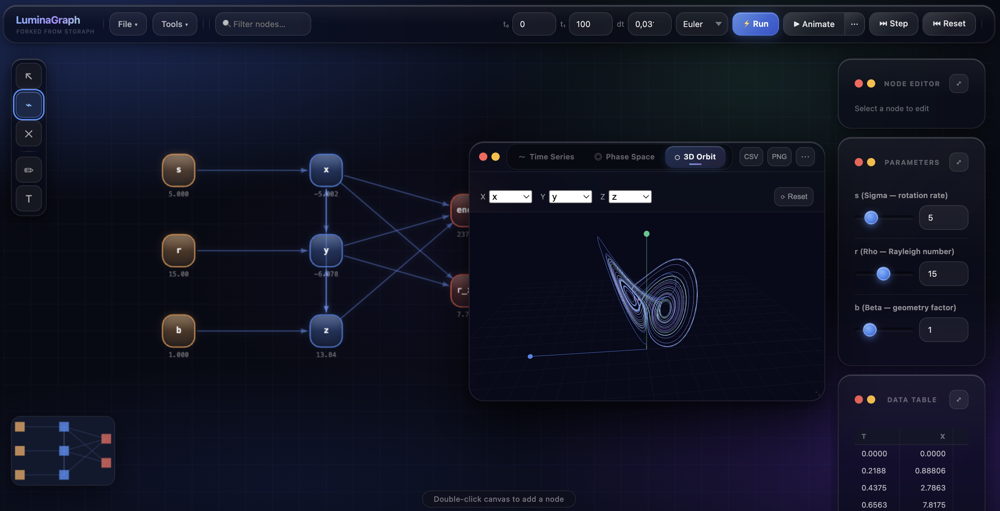

# LuminaGraph

> **A browser-native playground built on the foundations of [STGraph](https://www.stgraph.it/) by [Professor Luca Mari](https://www.liuc.it/en/university/faculties-and-departments/economics/luca-mari/) — Università Liuc.**



LuminaGraph is an experimental reimplementation of STGraph in JavaScript, served entirely in the browser with no build step and no backend. The goal is to explore new UX paradigms, modern visual design, and extended interactivity while staying faithful to the systems-dynamics modeling philosophy of the original Java application.

---

## What is STGraph?

STGraph is a Java desktop application for **systems thinking and systems dynamics modeling**. It allows users to build causal-loop and stock-and-flow diagrams, define variables with mathematical expressions, run simulations over time, and visualize the resulting dynamics. It is used in teaching and research contexts to model complex systems — from epidemics to ecosystems to economic circuits.

---

## LuminaGraph — Design Goals

- **Browser-native**: runs as a single `index.html` served by any HTTP server, no install required
- **UX experimentation**: tests new interaction patterns (glass morphism, genie animations, rubber-band selection, floating panels, 3D visualization) that would be harder to iterate on in the original Java codebase
- **Library integration**: explores how modern JS libraries (GSAP, Three.js, Chart.js-style canvas rendering) can enhance the modeling experience
- **Feature parity as a target**, not a constraint — some features are re-imagined rather than replicated

---

## Getting Started

```bash
# Clone or download the repository
cd LuminaGraph

# Serve with any HTTP server (Python built-in works fine)
python3 -m http.server 7824

# Open in browser
open http://localhost:7824
```

---

## ✅ Supported Features

### Core Modeling
| Feature | Notes |
|---|---|
| **Node types** | `state`, `algebraic`, `input` (parameter), `output`, `text label` |
| **Directed edges** | Click-drag between nodes to create connections |
| **Expression evaluation** | Full math expression engine with sandboxed JS compilation |
| **Derivative mode** | State nodes support `dx/dt` expressions (derivMode flag) |
| **Dependency resolution** | Topological sort ensures correct evaluation order |
| **Circular dependency detection** | Flagged at compile time |

### Simulation Engine
| Feature | Notes |
|---|---|
| **Euler integrator** | Fast, O(dt) accuracy |
| **Runge-Kutta 4** | Accurate, O(dt⁴) — recommended for chaotic/stiff systems |
| **Run all** | Instant full simulation from t₀ to t₁ |
| **Animate** | Real-time step-by-step with configurable speed |
| **Step mode** | Single-step with node-by-node evaluation highlight |
| **Reset** | Returns model to initial conditions |
| **Configurable t₀, t₁, dt** | Full time range control |

### Expression Scope (available in all expressions)
```
sin, cos, tan, asin, acos, atan, atan2
exp, log, log2, log10, sqrt, abs, sign
floor, ceil, round, min, max, clamp
pow, hypot, pi, e, Infinity
rand()         — uniform random in [0,1]
randn(μ, σ)    — Gaussian random sample
iff(c, a, b)   — conditional (also: if(c,a,b))
t              — current simulation time
dt             — current timestep
```

### Canvas Editor
| Feature | Notes |
|---|---|
| **Add nodes** | Double-click canvas |
| **Move nodes** | Drag |
| **Connect nodes** | Select Connect tool, drag from source to target |
| **Delete** | Delete tool click, or Backspace/Delete key |
| **Rubber-band selection** | Click-drag on empty canvas to select multiple nodes |
| **Multi-node drag** | Move entire selection |
| **Copy / Paste** | Cmd/Ctrl+C/V — preserves edges between copied nodes |
| **Cut** | Cmd/Ctrl+X |
| **Undo / Redo** | Cmd/Ctrl+Z / Cmd/Ctrl+Shift+Z |
| **Fit to screen** | F key or automatic on model load (88% zoom) |
| **Pan** | Middle mouse drag, or scroll wheel |
| **Zoom** | Ctrl + scroll wheel (fine-grained) |
| **Minimap** | Live overview in bottom-left corner |
| **Node resize** | Drag handles on selected node |
| **Search / filter** | Filter nodes by name or type in toolbar |
| **Right-click context menu** | Node operations, add gauge |

### Visualization
| Feature | Notes |
|---|---|
| **Time Series chart** | All non-input variables plotted over time with legend |
| **Phase Space 2D** | Any two variables as X/Y orbit |
| **3D Phase Space** | Interactive 3D orbit via Three.js — rotate, zoom, pan |
| **Data Table** | Tabular view of all simulation values per timestep |
| **Parameter sliders** | Interactive sliders for input nodes with defined min/max/step |
| **Gauge overlay** | Radial gauge widgets on canvas (via right-click menu) |

### Panels & Windows
| Feature | Notes |
|---|---|
| **Node Editor** | Full node properties editing (name, type, expression, init value, unit, description, slider range) |
| **Parameters** | Dedicated slider panel for all input nodes |
| **Data Table** | Simulation output table with float data |
| **Console / REPL** | Live JavaScript REPL with access to the running model |
| **Function Library** | Define reusable user functions, available in all expressions |
| **Analysis Panel** | Dependency analysis and feedback loop detection |
| **Model Diff** | Compare two model JSON snapshots |
| **Minimize / Restore** | All panels can be minimized to a taskbar at the bottom of the canvas with a genie animation |

### File & Sharing
| Feature | Notes |
|---|---|
| **Import JSON** | Load any STGraph-compatible model JSON |
| **Export JSON** | Save current model |
| **Share via URL** | Encode model in URL hash — shareable link |
| **Export chart as PNG** | Download current chart view |
| **Export data as CSV** | Download simulation data table |
| **Download error log** | Right-click the error badge |

### Built-in Example Models
- **Lorenz Attractor** — chaotic butterfly, default model (s=5, r=15, b=1, RK4)
- **Climate System** — CO₂/temperature/ice feedback loops
- **Logistic Growth** — population with carrying capacity
- **Predator–Prey** — Lotka-Volterra system
- **SIR Epidemic** — compartmental disease spread
- **Exponential Growth** — simple growth model
- **RC Circuit** — electrical analog

---

## ⚠️ Partially Supported

| Feature | Status |
|---|---|
| **`parameter` node type** (from original Java JSON) | Loaded gracefully as a neutral grey node, but treated as `algebraic` internally — re-save as `input` for full slider support |
| **JSON from original Java STGraph** | Structural differences in edge format (`id`, `sourcePort`, `controlPoints` fields are ignored) — model topology loads correctly |
| **Gauge widgets** | Basic radial gauge rendering exists; no interactive resize or styling options yet |
| **Quiz mode** | Skeleton implemented; question authoring UI is minimal |
| **Step mode animations** | Node highlight works; no trace table yet |

---

## ❌ Not Yet Supported

These features are not implemented yet in LuminaGraph:

| Feature | Notes |
|---|---|
| **Multi-chart layout** | Original supports positioning multiple independent chart windows with full layout control; LuminaGraph has one floating chart window |
| **`map3dto2d` projection function** | The original has a built-in 3D→2D projection helper for canvas drawing; LuminaGraph has a Three.js 3D orbit view instead |
| **Submodel / module system** | Grouping nodes into reusable submodels with defined interfaces |
| **Simulation comparison** | Running multiple scenarios and overlaying their time series |
| **Embedded media nodes** | Original supports image/video content inside nodes |
| **Table/matrix variables** | Array-valued variables with index access |
| **Agent / network simulation** | Spatial grid models and multi-agent primitives |
| **`sysTime()` / real-time mode** | Wall-clock time integration for real-time simulations |
| **Model metadata dialog** (full) | Title/author fields exist but no rich editing UI |
| **Adaptive step integrator (RK45)** | dt is fixed; no automatic step-size control |
| **Print / PDF export** | No print layout or PDF generation |
| **Collaborative editing** | No multi-user / sync features |
| **Plugin system** | Original supports Java-based plugins; no equivalent in LuminaGraph |
| **Desktop packaging** | Electron or similar wrapper not implemented |

---

## Architecture

```
LuminaGraph/
├── index.html              # Single-page app shell
├── css/
│   └── style.css           # Full design system (glass morphism, animations)
├── js/
│   ├── canvas.js           # Graph canvas: nodes, edges, selection, zoom/pan
│   ├── chart.js            # 2D time series + phase space renderer (Canvas 2D)
│   └── chart3d.js          # 3D phase space orbit (Three.js WebGL)
└── src/
    ├── core/
    │   ├── STNode.js        # Node data model + expression compiler
    │   ├── STModel.js       # Model container, integrators, simulation loop
    │   ├── Integrators.js   # Euler, RK4
    │   ├── ExpressionScope.js  # Math/helper functions available in expressions
    │   ├── Topology.js      # Topological sort, cycle detection
    │   └── Analysis.js      # Dependency analysis, feedback loops
    ├── data/
    │   └── Examples.js      # Built-in example models
    └── ui/
        ├── App.js           # Application controller — wires everything together
        ├── SliderPanel.js   # Parameter sliders
        ├── ConsolePanel.js  # JS REPL
        ├── FunctionLibrary.js  # User-defined function editor
        ├── AnalysisPanel.js # Dependency / loop analysis UI
        ├── ModelDiff.js     # Model comparison
        ├── ErrorLogger.js   # Error capture + localStorage persistence
        └── Minimap.js       # Canvas overview
```

**External dependencies** (CDN, no build step):
- [GSAP 3.12.5](https://gsap.com/) — spring animations, genie effects, panel transitions
- [Three.js r128](https://threejs.org/) + OrbitControls — 3D phase space

---

## Keyboard Shortcuts

| Key | Action |
|---|---|
| `F` | Fit all nodes to screen |
| `R` | Run simulation |
| `Space` | Toggle animate |
| `S` | Step once |
| `Backspace` / `Delete` | Delete selected node(s) |
| `Cmd/Ctrl + C` | Copy selected node(s) with edges |
| `Cmd/Ctrl + V` | Paste |
| `Cmd/Ctrl + X` | Cut |
| `Cmd/Ctrl + Z` | Undo |
| `Cmd/Ctrl + Shift + Z` | Redo |
| `Cmd/Ctrl` (hold) | Temporarily switch to Connect tool |
| `Escape` | Clear search filter |

---

## Credits

- **STGraph original application**: [Professor Luca Mari](https://www.liuc.it/en/university/faculties-and-departments/economics/luca-mari/), Università Liuc — Castellanza, Italy
- **LuminaGraph browser port & UX experimentation**: Luca Piola

> LuminaGraph is an independent, non-commercial experiment and is not an official release of STGraph.
